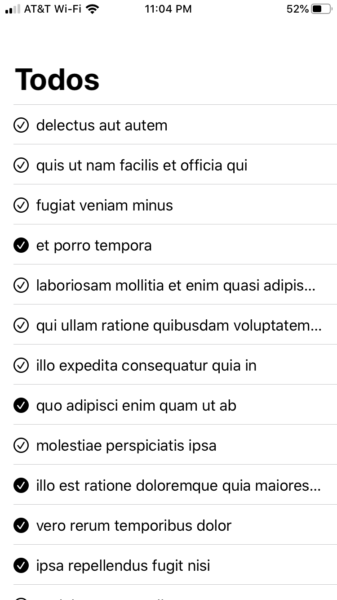

# `RequestView`
`RequestView` is a view that asynchronously loads data from the web.

`RequestView` is powered by a `Request`. It handles loading the data, and you can focus on building your app.
It takes a `Request`, a placeholder and any content you want rendered.

> **Important:** You must handle when `data` is nil in your content, as the `RequestView` renders the content and the placeholder at the same time, so it will be rendered at least once when data is nil (and possibly again if the request fails).

```swift
RequestView(Request {
    Url("https://api.example.com")
}) { data in
    <<Content>>
    <<Placeholder>>
}
```

## Example:
Here's an example of loading in a `List` of todos from `jsonplaceholder.typicode.com`:
```swift
struct Todo: Codable, Identifiable {
    let id: Int
    let userId: Int
    let title: String
    let completed: Bool
}
```
```swift
struct ContentView : View {
    var body: some View {
    NavigationView {
        RequestView(Request {
            Url("https://jsonplaceholder.typicode.com/todos")
        }) { data in
            List(data != nil ? try! JSONDecoder().decode([Todo].self, from: data!) : []) { todo in
                HStack {
                    Image(systemName: "checkmark.circle" + (todo.completed ? ".fill" : ""))
                    Text(todo.title)
                    }
                }
                Text("Loading...")
            }
            .navigationBarTitle(Text("Todos"))
        }
    }
}
```
#### Result:

